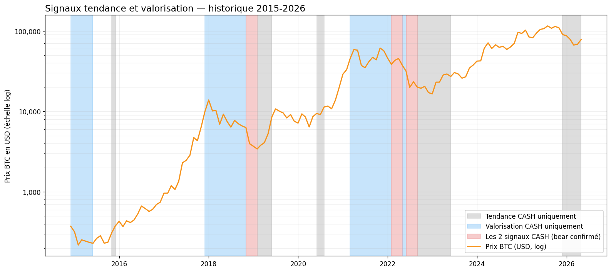
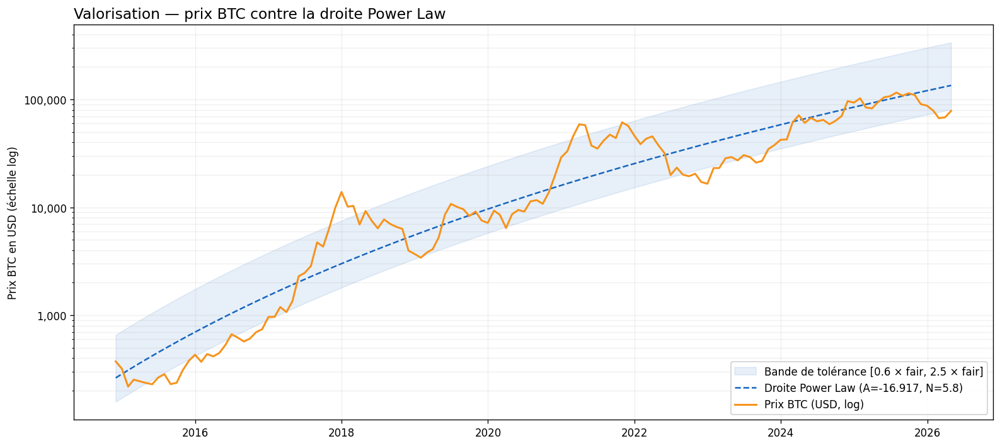
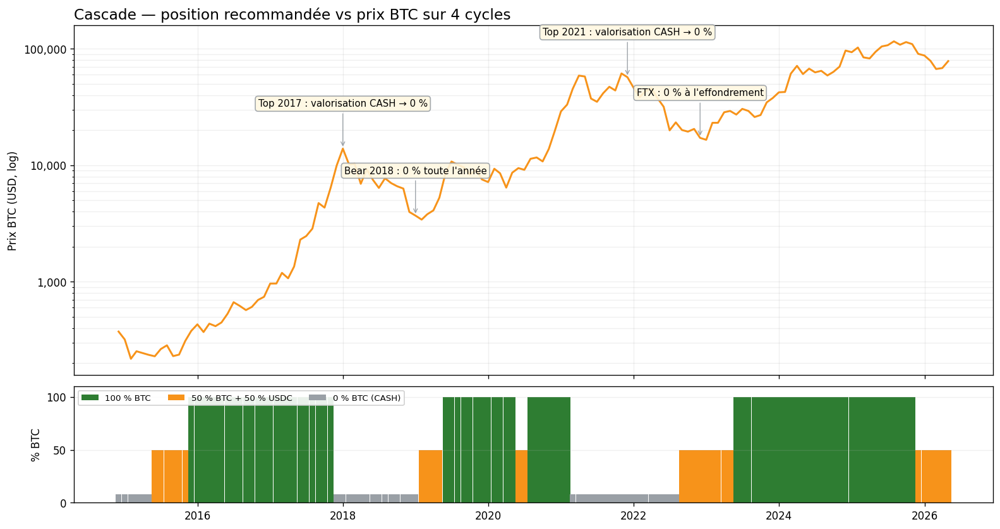

# Méthodologie — les 2 signaux de ChillBTC

Cette page explique **pourquoi** la stratégie utilise exactement 2 signaux, un
de **tendance** et un de **valorisation**, **comment** chacun est construit, et
**quand** ils se sont avérés utiles ou coûteux sur l'historique BTC.

> La stratégie est gelée depuis 2026-05-01 jusqu'à la revue annuelle du 1ᵉʳ
> janvier suivant. Les paramètres décrits ici sont les paramètres live.

---

## 1. Pourquoi 2 signaux et pas 1

Un signal unique reste prisonnier d'un régime de marché. La **tendance**
fonctionne bien quand le prix se déplace franchement dans une direction, mais
rate les retournements en zone euphorique. La **valorisation** repère ces
zones euphoriques, mais reste muette quand le prix traîne à mi-chemin de sa
trajectoire long-terme.

ChillBTC combine donc deux signaux **orthogonaux** : l'un regarde la variation
cumulée du prix sur les 11 derniers mois (tendance), l'autre regarde le
niveau absolu par rapport à une droite de référence (valorisation). Quand
l'un des deux dit *CASH*, la position est allégée ou coupée, sans attendre
que le second s'en rende compte.

Ce choix de 2 signaux est aussi un choix **anti-overfit**. Un ensemble à 5 ou
10 signaux optimisés simultanément sur ~180 observations mensuelles produirait
un backtest flatteur et un live décevant. Deux signaux, chacun à 1 ou 2
paramètres, restent auditables et robustes.

---

## 2. Tendance — Time-Series Momentum

Le signal de tendance répond à une question simple : **le prix BTC a-t-il
monté sur les 11 derniers mois** ? Si oui, la tendance est favorable et le
signal dit BUY. Sinon, il dit CASH.

C'est bien une **comparaison ponctuelle** entre le prix d'aujourd'hui et
celui d'il y a 11 mois. L'intuition vient d'un résultat académique largement
documenté : sur un grand
nombre de marchés, le rendement passé sur 1 à 12 mois prédit le rendement du
mois suivant. Moskowitz, Ooi et Pedersen (2012) l'ont montré sur 58 marchés
futures (actions, devises, matières premières, obligations) de 1965 à 2009.
Le signal est significatif, transverse aux classes d'actifs, et persiste dans
les extrêmes de marché. Asness, Moskowitz et Pedersen (2013) ont prolongé le
résultat au couple *value + momentum* sur 8 marchés globaux.

### Pourquoi n = 11 et pas 12

La fenêtre n = 11 a été retenue par optimisation walk-forward sur l'axe
minimisation de la **baisse max** (plus grosse baisse temporaire sur
papier). Ce n'est pas un pic isolé : le plateau de stabilité couvre
n ∈ {9, 10, 11, 12, 13}, tous produisant une baisse max voisine. Un
paramètre choisi dans un plateau large résiste mieux aux régimes
hors-échantillon qu'un pic étroit.

### Illustrations historiques

Trois moments charnières où la tendance a pesé :

- **2018-09** : la tendance bascule CASH après un retard de plusieurs mois
  sur le top de janvier. La stratégie sort avant la chute de Q4 2018.
- **2020-03** : la tendance reste CASH après le krach Covid. La stratégie
  rate le rebond en V. C'est le coût du lag TSMOM, assumé par construction.
- **2022-04 à 2022-08** : la tendance reste CASH tout au long de la descente
  Luna / 3AC / FTX. La stratégie traverse la baisse à 0 % ou 50 %.

*Prix BTC en échelle log avec les 3 états CASH codés par couleur
mutuellement exclusive : **gris** = seule la tendance est CASH (momentum
faible, prix encore raisonnable), **bleu clair** = seule la valorisation
est CASH (prix surchauffé, tendance encore haussière), **rose** = les 2
signaux CASH simultanément (marché baissier confirmé). Les zones non ombrées sont
les mois où les 2 signaux disent BUY.*

---

## 3. Valorisation — Power Law

Le signal de valorisation répond à une autre question : **le prix BTC est-il
cher ou pas cher par rapport à sa trajectoire long-terme** ? La référence est
une droite en log-log : `log P = A + N × log(days_since_genesis)`, avec N = 5.8
fixé et A recalibré une fois par an au 1ᵉʳ janvier, puis gelé le reste de
l'année.

Quand le prix s'écarte fortement au-dessus de la droite, la valorisation
bascule CASH. Quand le prix repasse nettement en dessous, elle rebascule BUY.
Entre les deux, elle maintient son état précédent.

### Intuition théorique

L'idée d'une trajectoire en loi de puissance pour BTC a été popularisée par
Santostasi (2018) sur Medium. L'argument repose sur l'analogie avec les
réseaux à attachement préférentiel étudiés par Barabási et Albert (1999) :
quand l'adoption d'un protocole croît, elle tend à suivre une loi d'échelle,
pas une exponentielle. Cette analogie est **informelle** et n'a pas fait
l'objet d'une validation académique peer-reviewed pour BTC. Elle offre
toutefois un cadre intuitif pour lire les cycles : la droite Power Law agit
comme une moyenne mobile très longue, résistante aux bulles.

### Pourquoi A est figé une fois par an

Recalibrer A chaque mois reviendrait à ajuster la référence sur le prix
lui-même, vidant le signal de son contenu anti-bulle. Figer A pour l'année
coupe ce biais. Le coût est une désynchronisation possible si l'adoption
accélère brutalement, mais c'est le compromis assumé.

### Illustrations historiques

- **2017-12** : `close/fair` dépasse 4. La valorisation CASH au pic. La
  stratégie coupe juste avant le krach de 2018.
- **2021-11** : la valorisation CASH dès l'été 2021, tenue jusqu'au bottom
  2022. La stratégie évite l'essentiel de la baisse.
- **2023-01** : `close/fair < 0.6` au bottom à 17 000 USD. La valorisation
  repasse BUY tôt, captant une partie du rebond vers 23 000 USD en janvier.

*Droite Power Law en pointillé bleu, bande de tolérance
[0,6 × fair ; 2,5 × fair] en bleu clair. Un prix au-dessus de la bande
supérieure fait basculer la valorisation en CASH ; un prix sous la bande
inférieure la ramène à BUY. Entre les deux, l'état précédent est maintenu.*

---

## 4. Cascade — combinaison OR + dosage 100 / 50 / 0

Les 2 signaux se combinent par **logique OR défensive** : si l'un dit CASH,
la position est au moins allégée. Le dosage prend trois valeurs :

- Tendance BUY et valorisation BUY, 100 % BTC, climat haussier assumé
- Tendance BUY et valorisation CASH, 0 % BTC, la valorisation CASH prime
  (la bulle l'emporte sur la tendance résiduelle)
- Tendance CASH et valorisation BUY, 50 % BTC + 50 % USDC, signaux opposés
- Tendance CASH et valorisation CASH, 0 % BTC + 100 % USDC, marché baissier confirmé

Le dosage à 3 crans (0 %, 50 %, 100 %) réduit le coût de friction par rapport
à un binaire tout-ou-rien : une bascule partielle de 1.00 à 0.50 ne paie la
commission que sur la moitié tradée. L'approche par ensemble sur signaux
orthogonaux relève de la littérature *factor investing* documentée par
Bender, Briand, Melas et Aylur Subramanian (2013).

### Illustrations cross-cycles

- **2017** cycle haussier : valorisation CASH dès Q4, tendance encore BUY.
  Position à 50 % au pic.
- **2018** cycle baissier : tendance et valorisation CASH simultanément.
  Position à 0 % pendant l'essentiel de la chute.
- **2021** cycle : tendance BUY presque toute l'année, valorisation CASH dès
  l'été. Position à 50 % au top de novembre.
- **2022** FTX : tendance et valorisation CASH avant l'effondrement. Position
  à 0 % en novembre.

*Prix BTC en haut avec annotations des moments charnières. Barre du bas
codée par couleur : vert = 100 % BTC, orange = 50 % BTC + 50 % USDC,
gris = 0 % (cash intégral). Les périodes grises correspondent aux marchés baissiers
markets où les deux signaux disent CASH, les périodes orange isolées aux
tops où seule la valorisation a basculé.*

---

## 5. Limites et menaces de validité

**Échantillon petit.** Le backtest couvre environ 2,5 cycles BTC complets
(2015-2026). Les intervalles de confiance sur la perf annualisée et la
**baisse max** sont larges. Tu dois lire les chiffres comme des ordres de grandeur, pas
comme des garanties point-à-point.

**Risques d'invalidation.** Deux scénarios casseraient la stratégie sans
bruit préalable :

1. L'institutionnalisation du BTC accélère l'arbitrage et aplatit la
   prime TSMOM, comme observé sur plusieurs marchés actions.
2. L'adoption BTC sature avant 10 ans et la trajectoire dévie de la loi de
   puissance vers un plateau logistique, rendant la droite Power Law
   biaisée.

**Garde-fous en place.** Le premier filet, et le plus direct contre le
risque n° 2 ci-dessus, est le **recalibrage annuel de A le 1ᵉʳ janvier** :
si le rythme d'adoption BTC dévie, la droite Power Law se réaligne à chaque
revue plutôt que de fossiliser une pente obsolète. Le gel en cours d'année
évite l'auto-référence mensuelle, mais la fenêtre de révision reste ouverte
chaque année. S'ajoutent l'optimisation par walk-forward, la validation par
leave-one-cycle-out, le plateau de stabilité exigé sur les paramètres, et
le journal mensuel obligatoire pour détecter la dérive. Ce sont des filets,
pas des certitudes. Le chapitre [`CONTRIBUTING.md`](../CONTRIBUTING.md)
détaille le scope verrouillé anti-overfit.

---

## 6. Bibliographie

1. Moskowitz, T. J., Ooi, Y. H., Pedersen, L. H. (2012). Time series
   momentum. *Journal of Financial Economics*, 104(2), 228-250.
   [doi:10.1016/j.jfineco.2011.11.003](https://doi.org/10.1016/j.jfineco.2011.11.003)
2. Asness, C. S., Moskowitz, T. J., Pedersen, L. H. (2013). Value and
   Momentum Everywhere. *Journal of Finance*, 68(3), 929-985.
   [doi:10.1111/jofi.12021](https://doi.org/10.1111/jofi.12021)
3. Goyal, A., Welch, I. (2008). A Comprehensive Look at the Empirical
   Performance of Equity Premium Prediction. *Review of Financial Studies*,
   21(4), 1455-1508.
   [doi:10.1093/rfs/hhm014](https://doi.org/10.1093/rfs/hhm014)
4. Goyal, A., Welch, I., Zafirov, A. (2024). A Comprehensive 2022 Look at
   the Empirical Performance of Equity Premium Prediction. *Review of
   Financial Studies*, 37(11), 3490-3557.
   [doi:10.1093/rfs/hhae044](https://doi.org/10.1093/rfs/hhae044)
5. Barabási, A.-L., Albert, R. (1999). Emergence of Scaling in Random
   Networks. *Science*, 286(5439), 509-512.
   [doi:10.1126/science.286.5439.509](https://doi.org/10.1126/science.286.5439.509)
6. Bender, J., Briand, R., Melas, D., Aylur Subramanian, R. (2013).
   Foundations of Factor Investing. *MSCI Research Insight*.
   [msci.com](https://www.msci.com/research-and-insights/paper/foundations-of-factor-investing)
7. Santostasi, G. (2018). The Bitcoin Power-Law Theory. *Medium* (source
   non peer-reviewed, citée pour l'origine de l'idée).
   [medium link](https://giovannisantostasi.medium.com/the-bitcoin-power-law-theory-962dfaf99ee9)

---

## 7. Usage d'IA dans la rédaction

Cette page a été rédigée avec l'assistance de Claude Opus 4.7 (Anthropic)
pour le *drafting* du texte, la recherche et la vérification des
références bibliographiques via DOI. Les auteurs du projet ChillBTC
prennent l'entière responsabilité du contenu, ont vérifié chaque
affirmation numérique contre le code et les artefacts de backtest, et
confirment qu'aucune IA ne figure comme autrice.
